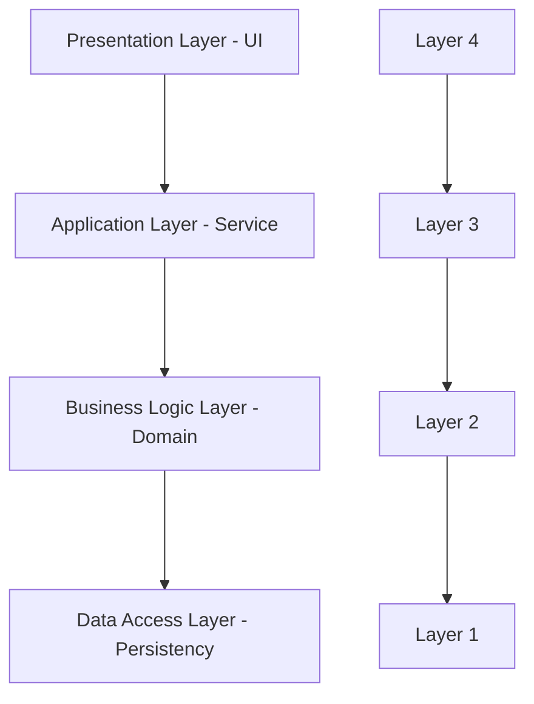
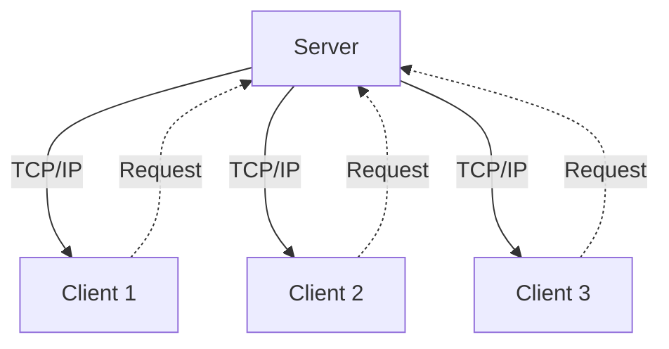
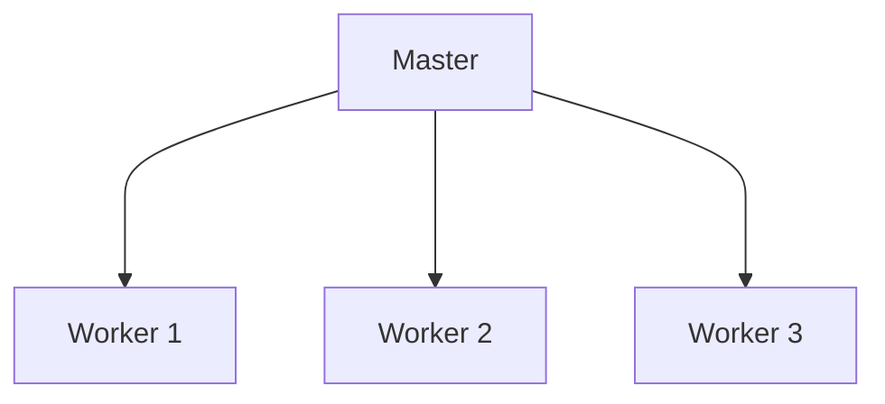
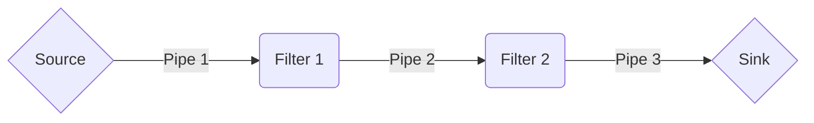
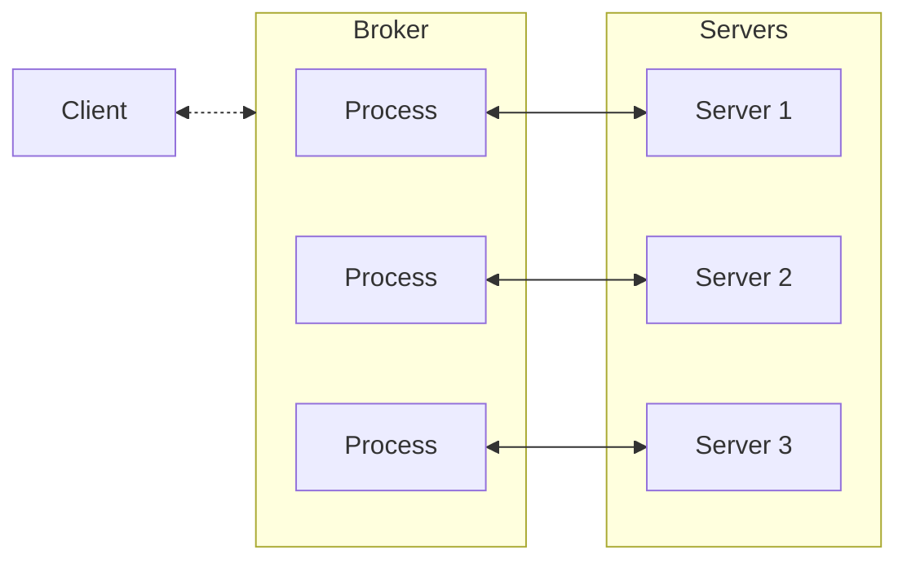
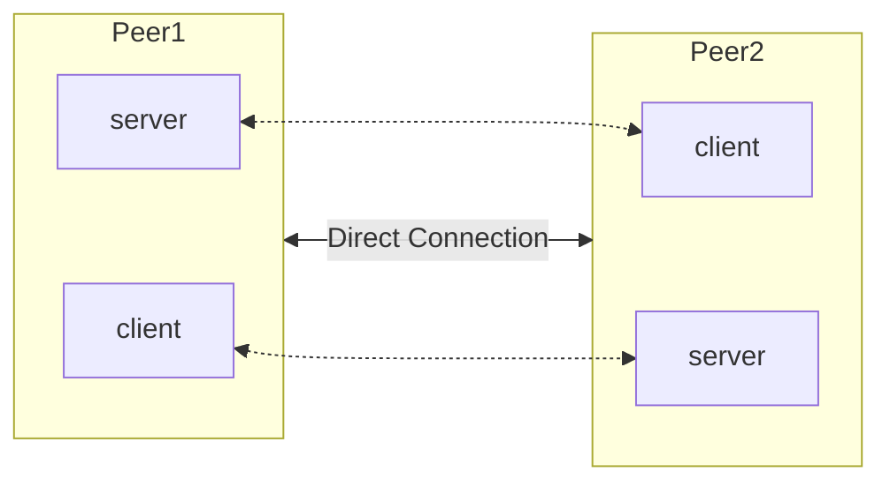
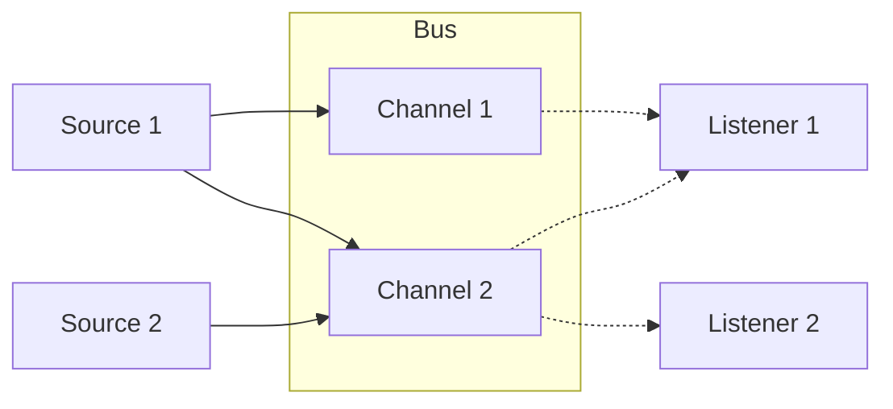
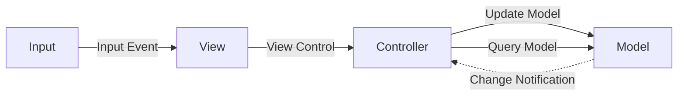
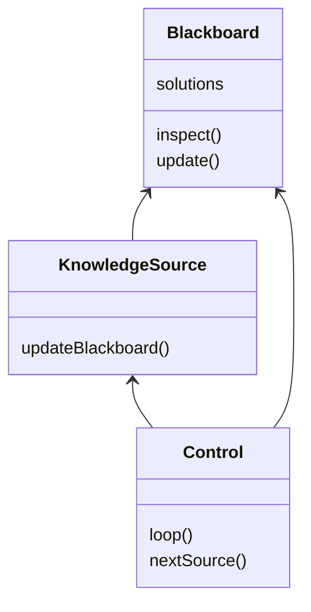
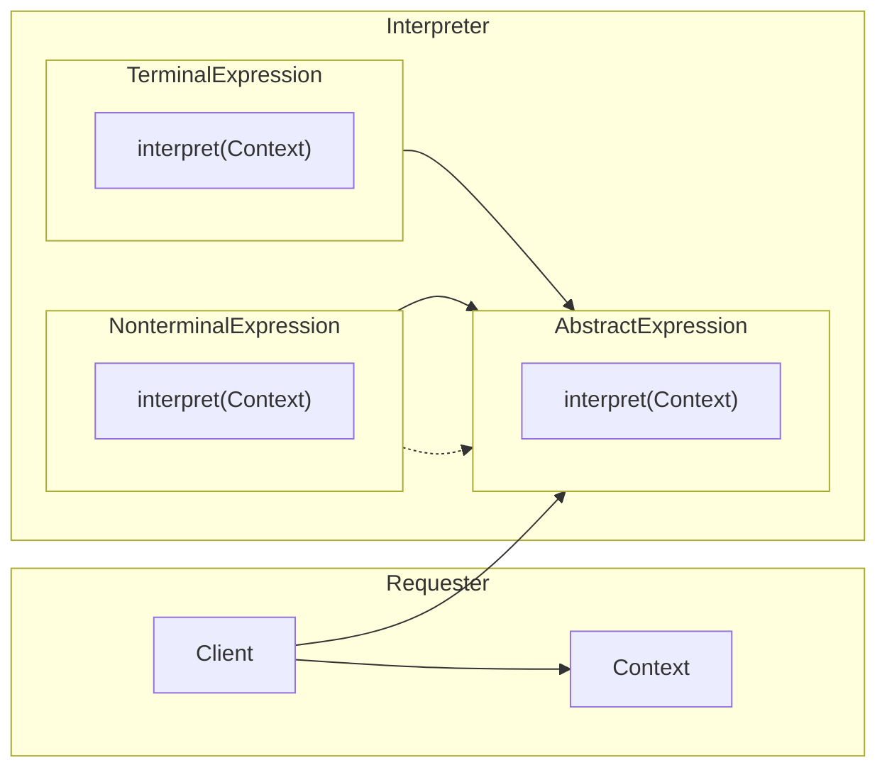

# Design Patterns
---
## Layered Pattern
---
> Essa pattern geralmente e utilizada para organizar programas de forma sequencial que sejam divididos em subtasks. Cada layer fornece serviços para a proxima e nao se comunicam fora de ordem.

Exemplo:
- Desktop Apps
- E-Commerce Web Apps

## Client-Server Pattern
---
> Geralmente consiste de um servidor que se comunica com varios clientes, e esse componente servidor fornece os serviços pra uso desses multiplos clientes, e espera por requests desses clientes.

Exemplo:
- Provedor de E-mail
- Compartilhamento de Documentos
- Internet Banking

## Master-Slave Pattern
---
> Esse pattern conta com dois tipos de componentes: o mestre e o trabalhador. O mestre e responsavel por dar trabalho e distribuir esse trabalho com os trabalhadores.

Exemplo:
- Database replication
- Perifericos conectados no seu computador
- Loadbalancer

## Pipe-Filter Pattern
---
> Esse pattern gerencia dados na medida em que eles sao transportados por um "pipe". Cada passo dentro desse "pipe" e fechado por um componente de filtro.

Exemplo:
- Compiladores (Cada filtro e uma etapa da compilacao)
- Workflows
- Bouncers
- Parsers
- Middlewares

## Broker Pattern
---
>Esse pattern e muito usado para oregarizar e
>estruturar sistemas distribuidos de maneira em que
os componentes sejam os mais autonomos possivel.
Existe um componente chamado de Broker responsavel
por coordenar a comunicacao entre os componentes

Exemplos:
- Loadbalancer
- Message Brokers(Apache Kafka, Rabbi…)

## Peer-to-Peer Pattern
---
>Nesse pattern cada componente individual e responsavel por servir e consumir de outros componentes igualmente autosuficientes

Exemplos:
- File Sharing (Torrent, G2)
- Protocolos Multimidia
- Crypto

## Event Bus Pattern
---
>Nesse pattern a comunicacao acontece via eventos, pra isso ser eficaz voce tera emissores, consumidores e canais pra passar esses eventos (Conjunto de canais geralmente e chamado de Bus). As fontes publicam eventos nos canais e os consumidores sao notificados dos novos eventos.

Exemplo:
- Servicos de Notificacao
- Comunicacao entre Microservicos

## Model View Controller Pattern (MVC)

> Esse pattern divide a aplicação em três níveis de abstração: 
> - Model: Funcionalidade Central e Dados
> - View: Display pro usuário
> - Controller: Gerencia os inputs do usuário

Exemplo:
- Web Frameworks (Django, Rails)

## Blackboard Pattern

> Esse pattern geralmente é utilizado quando não dá pra resolver o problema utilizando um outro pattern.  
> Ele conta com 3 componentes principais:
> - Blackboard: Uma entidade global de memória contendo os objetos das soluções
> - Knowledge Source: módulos especializados com suas próprias representações
> - Control Component: operadores, executam módulos

> Todos esses componentes têm acesso à blackboard e eles podem gerar novos objetos que serão adicionados à blackboard.

Exemplo:
- Reconhecimento de Fala
- Identificação de Veículo, pessoa, etc.
- Interpretação de Sonar

## Interpreter Pattern

> Esse pattern é usado pra criar um componente que interpreta um programa utilizando uma linguagem dedicada.  
Ele é focado em analisar linhas e transformar em ações.

Exemplos:
- Databases SQL
- Interpretadores de Linguagem de Programacao